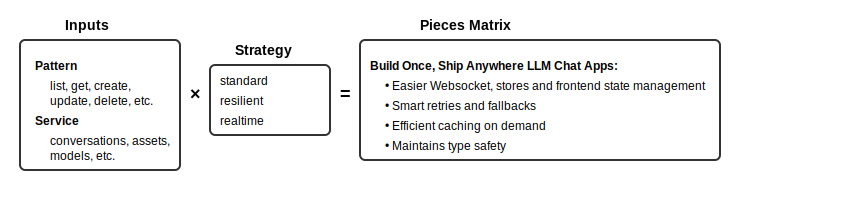

# Pieces Matrix Adapter

I've thrown the most common-use Pieces Typescript SDK types into an adapter recipe to create some robust, re-usable call handlers. In a nutshell:

`pattern × service × strategy = specific API calls`



# Quick Start

Clone this repo and install the core package directly from local copy:

```bash
cd /path/to/piecesmatrix
# Using npm
npm install /packages/core

# Using pnpm
pnpm add /path/to/piecesvelte/packages/core
```
Or you can install from my remote:

```bash
npm install github:seantiz/piecesvelte/packages/core
```

## Basic Usage

After installation, import and start up the adapter client:

```typescript
import { pieces, newAdapterClient } from 'core';

// Start the adapter client with default settings
newAdapterClient({
  port: 39000,
  basePath: 'http://localhost'
});

// Example: Check if the matrix adapter client can talk to your local Pieces OS server
async function checkConnection() {
  try {
    const health = await pieces.get('wellKnown.health');
    console.log('Connection status:', health.status);
    return health.status === 'running';
  } catch (error) {
    console.error('Failed to connect to Pieces OS:', error);
    return false;
  }
}

// Example: Ask a question with QGPT
async function askQuestion(query) {
  return pieces.send('qgpt.question', { query });
}
```

## Key Benefits

1. **Better DX** - Intuitive REST API naming means you'll use handlers without hunting through OpenAPI docs for machine-generated property names.

2. **Cut down debugging time** - This is a work in progress. Your local Pieces OS server _does_ have its own `Configuration` pipeline, but I've spent two years building with Pieces and the adapter's config state is the product of some hard-earned lessons on where to save time. Livestream pipelines can and will frequently go wrong after deployment. Built-in safeties catch errors before they waste your days.

3. **Smaller Footprint** - This isn't a criticism of the larger Pieces Typescript SDK, which itself covers more possible use-cases but ships with over 1MB of imports to cover them. This adapter is aims to ship with the most common-use endpoints only.


## The Big Aim
The biggest long-term problem of Cloud-LLM upstream services is latency. Added to that, people often want ChatGPT-like streaming and context-accuracy but have modest resources.

The Pieces OS SDK already handles accuracy and resource efficiency, so this adapter isn't pretending to do any revolutionary work on those two needs.

But speed is where I'm hoping the Matrix adapter will help you in your workflow.

We aim to keep latency down by bringing speed of DX, with minimal latency traded off in the backend. That's why the adapter uses a flatmap matrix to do its work.
